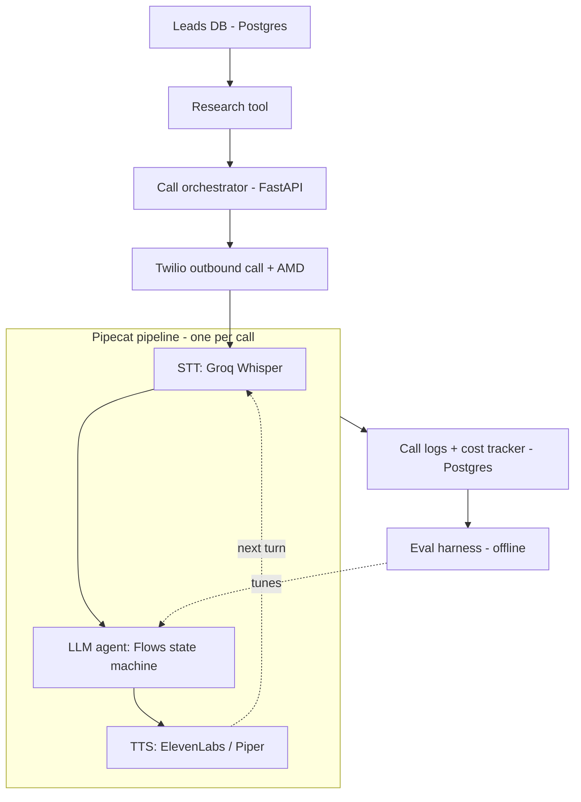
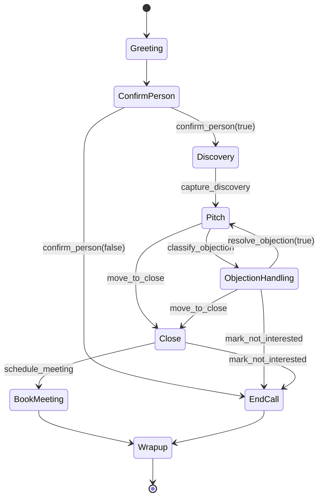

# Vox-Orchestrator: AI Cold-Calling Voice Agent

An autonomous voice AI agent that researches a business lead, places an outbound call, carries a real multi-turn sales conversation, handles objections, and books a meeting — with no human on the call.

This is not a "call an LLM and pipe it through TTS" demo. The project is built around **agent reliability**: an explicit state machine instead of a single freeform prompt, validated tool-calling instead of hoping the model does the right thing, retry/fallback logic for real-world failure modes, per-call cost tracking, and an automated evaluation harness that scores the agent against a labeled test set on every change.

```
Task completion 100.0%  ·  Correct tool sequence 100.0%  ·  Hallucinated tool calls 0.0%
46 personas · avg 3.76 turns to resolution · $0.1623 simulated cost per call
```

<sub>Offline baseline — deterministic mock provider, prompt `v2-strict-tools`. Full report: [`eval/reports/baseline.md`](./eval/reports/baseline.md). What the numbers do and don't mean: [`docs/evaluation.md`](./docs/evaluation.md#baseline).</sub>

---

## Table of contents

- [Why this exists](#why-this-exists)
- [What makes this different from a chatbot demo](#what-makes-this-different-from-a-chatbot-demo)
- [Architecture](#architecture)
- [Conversation state machine](#conversation-state-machine)
- [Tech stack](#tech-stack)
- [Project structure](#project-structure)
- [Getting started](#getting-started)
- [Using it](#using-it)
- [Reliability engineering](#reliability-engineering)
- [Eval harness](#eval-harness)
- [Cost tracking](#cost-tracking)
- [Testing and CI](#testing-and-ci)
- [Deployment](#deployment)
- [Roadmap](#roadmap)
- [Compliance note (India)](#compliance-note-india)
- [Further reading](#further-reading)
- [License](#license)

---

## Why this exists

Manually cold-calling a list of business leads one by one doesn't scale. This project automates the first call: researching the business, opening with specific context, pitching, handling common objections, and either booking a meeting or logging a clean outcome — freeing a human to only step in for the calls that actually convert.

## What makes this different from a chatbot demo

| Concern | How it's handled here |
|---|---|
| Conversation control | Explicit state machine — **every** transition is triggered by a schema-validated tool call, not by the model deciding conversationally when to move on |
| Structured outputs | Nine strict Pydantic tool schemas (`extra="forbid"`, closed enums, semantic validators); illegal tools are never even offered to the model in a state where they don't belong |
| Failure handling | Six documented failure modes with bounded, individually tested guards — low ASR confidence, voicemail, malformed tool calls, LLM outage, silence, objection loops |
| Cost visibility | STT seconds, LLM tokens, TTS characters and telephony seconds logged per call and priced to an actual dollar figure, down to cost per booked meeting |
| Correctness measurement | An offline harness runs 46 labeled personas against the real flow logic and scores task completion, tool-sequence accuracy and hallucination rate — and is proven to catch a deliberately introduced prompt regression |
| Compliance | TRAI DLT status, National DNC flags and IST calling hours are enforced in code before Twilio is ever contacted |

Full technical detail: [`Project-Details.md`](./Project-Details.md) (the spec) and [`docs/`](./docs) (how it was built).

## Architecture



The conversation engine is pure async Python that depends only on an `LLMClient`
protocol — Pipecat is the transport, not the brain. That seam is why the eval harness can
drive the *real* flow logic with a deterministic model, and why 151 tests run in ~5
seconds with no database server, no API key and no network. Details:
[`docs/architecture.md`](./docs/architecture.md).

## Conversation state machine



Two independent gates gate every move: the tool must be legal in the current state
(`allowed_states`), and the edge must exist in the transition table. If either disagrees
the conversation does not advance — the model gets one corrective retry, then a scripted
safe line. `vox flow show` prints the live machine and the tools callable from each state.
Details: [`docs/state-machine.md`](./docs/state-machine.md).

## Tech stack

| Layer | Choice |
|---|---|
| Orchestration | Pipecat + Pipecat Flows (`pip install -e ".[voice]"`) |
| Telephony | Twilio (Voice, Media Streams, AMD) |
| Speech-to-text | Groq-hosted Whisper (primary), Deepgram (fallback) |
| LLM | Groq (Llama 3.3 70B) → Gemini Flash failover, plus a deterministic mock for tests/eval |
| Text-to-speech | ElevenLabs (primary), Piper (fallback, self-hosted, $0) |
| Database | PostgreSQL (Neon / Supabase) via SQLAlchemy 2.0 async + Alembic; SQLite for dev and CI |
| Cache | Redis (Upstash), with an in-process fallback |
| Backend | FastAPI + Typer CLI (`vox`) |
| Hosting | Local + ngrok (dev) → Koyeb / Cloud Run (persistent) |
| CI/CD | GitHub Actions — lint, tests on 3.11 + 3.12, migration up/down, eval gate, image build |
| Observability | structlog (JSON in prod) + optional Arize Phoenix / OTel tracing |

## Project structure

```
.
├── app/
│   ├── main.py                 # FastAPI app factory, lifespan, middleware
│   ├── config.py               # pydantic-settings; every knob, one place
│   ├── enums.py                # states, outcomes, objection types, lead statuses
│   ├── api/                    # health, leads, calls, Twilio webhooks + media stream
│   ├── pipeline/               # engine, state machine, guards, prompts, Pipecat runner
│   ├── tools/                  # tool schemas, specs and the validating registry
│   ├── llm/                    # Groq / Gemini / mock clients + failover router
│   ├── stt/  tts/  telephony/  # provider adapters, Twilio client, AMD, compliance gate
│   ├── research/               # pre-call business research + caching
│   ├── costs/                  # rate card and per-call cost tracker
│   ├── services/               # call service, campaign runner, reporting
│   ├── db/                     # models, repositories, session management
│   └── cli.py                  # `vox` operator CLI
├── eval/
│   ├── personas/catalog.py     # 46 labeled synthetic business owners
│   ├── simulated_caller.py     # scripted + LLM-roleplay callers
│   ├── scoring.py  report.py   # metrics and Markdown/JSON reports
│   └── reports/baseline.md     # committed baseline
├── tests/                      # 151 tests
├── migrations/                 # Alembic (async, batch-mode safe on SQLite)
├── docs/                       # architecture, state machine, reliability, eval, ops, compliance
├── ci/github-actions/          # CI + CD workflows (see that folder's README)
├── Dockerfile  docker-compose.yml  Makefile
├── Project-Details.md          # the specification
├── Project-Planning.md         # phase plan (all phases implemented)
└── progress.md                 # build log: what was built, and why
```

## Getting started

**Prerequisites**: Python 3.11+. Everything else is optional for development.

```bash
git clone https://github.com/Krypto-etox/vox-orchestrator.git
cd vox-orchestrator
make install        # venv + dependencies
make env            # cp .env.example .env
make test           # 151 tests, no external services needed
make eval           # regenerate the baseline eval report
make run            # http://localhost:8000/docs
```

The defaults are SQLite, an in-process cache and the mock LLM, so the suite, the CLI and
the eval harness all work offline. For real calls fill in `.env` (see
[`.env.example`](./.env.example) — every variable is documented), install the voice extra
with `make install-voice`, and follow the Twilio setup in
[`docs/operations.md`](./docs/operations.md#3-twilio-setup).

## Using it

```bash
vox doctor                                  # which integrations are configured
vox db init && vox leads import data/sample_leads.csv
vox leads research --limit 20               # cache 1–2 lines of context per business
vox call dial <lead-id>                     # place a call
vox call dial <lead-id> --dry-run           # everything except talking to Twilio
vox call simulate <lead-id> --persona price_02   # full text rehearsal, persisted like a real call
vox campaign run --limit 25                 # dial every lead that is due
vox call show <call-id>                     # transcript, tool calls, cost
vox costs report --days 7                   # cost per call, cost per booked meeting
vox flow show                               # the state machine and its tools
```

Same operations over HTTP at `/docs` (`POST /calls/dial`, `POST /campaigns/run`,
`GET /reports/costs`, lead CRUD, and the four Twilio endpoints).

## Reliability engineering

Every row of the failure matrix in the spec is implemented as a small, independently
tested guard object — no LLM, no I/O, deterministic:

| Failure mode | Handling |
|---|---|
| Low ASR confidence | Ask for a repeat once, then proceed with the best-guess transcript |
| Voicemail (Twilio AMD) | `log_voicemail`, hang up without pitching, retry on the backoff ladder |
| Malformed / illegal tool call | Re-prompt once with the validation error, then a scripted safe line |
| LLM timeout or outage | Bounded retries, then automatic failover to the secondary provider |
| Silence | "Are you still there?" once, then a graceful hangup |
| >3 objection cycles | Force Close, then force EndCall — the model doesn't get a vote |

Plus a hard turn budget, a wall-clock call cap, and a compliance gate that refuses to dial
outside IST calling hours or against a DNC-flagged lead. Details and the test that covers
each row: [`docs/reliability.md`](./docs/reliability.md).

## Eval harness

The centerpiece. A second caller — scripted by default, or an LLM playing the persona —
runs against the **real** engine, tools and prompts, text-only, and scores the result.

```bash
make eval              # 46 personas -> eval/reports/baseline.{json,md}
make eval-regression   # the control prompt, diffed against the baseline
```

**Baseline** (mock provider, prompt `v2-strict-tools`, 46 personas):

| Metric | Value |
|---|---:|
| Task completion rate | **100.0%** |
| Correct tool sequence rate | **100.0%** |
| Hallucinated tool-call rate | **0.0%** |
| Avg turns to resolution | **3.76** |
| Booking rate | 52.2% |
| Simulated cost | $7.4645 total · $0.1623 per call |

**Proof it detects regressions.** A deliberately loosened prompt variant (`v1-loose`) — a
conventional "be a helpful sales agent" instruction with the same tools attached — is kept
in the tree as a control:

| Metric | `v2-strict-tools` | `v1-loose` | Δ |
|---|---:|---:|---:|
| task_completion_rate | 1.0 | 0.7609 | ▼ -0.2391 |
| correct_tool_sequence_rate | 1.0 | 0.3913 | ▼ -0.6087 |
| avg_turns_to_resolution | 3.76 | 8.26 | ▲ +4.50 |
| pass_rate | 1.0 | 0.3913 | ▼ -0.6087 |

Tool-sequence accuracy collapses to 39% while task completion only falls to 76% — which is
exactly why tool discipline is measured separately from outcomes. 100% against a
deterministic caller is a **floor, not a conversion rate**; the honest caveats are in
[`docs/evaluation.md`](./docs/evaluation.md#baseline).

## Cost tracking

Every call writes one `cost_logs` row — STT seconds, LLM input/output tokens, TTS
characters, telephony seconds — priced from `app/costs/rates.py` with the per-component
breakdown stored as JSON so historical calls can be re-priced when a provider changes its
rate card. `vox costs report` gives total spend, cost per call, the component split, the
outcome breakdown and **cost per booked meeting**, which is the only number that decides
whether running this is worth it.

## Testing and CI

```
151 tests · ~5s · no database server, no API key, no network
```

`tests/` covers the tool registry, the state machine, the full engine loop (including
every failure mode), the cost tracker, telephony and compliance, the LLM router and
provider clients, repositories, the call service and campaign runner, all API routes
including Twilio signature enforcement, the research scraper, the eval harness, the config
and guards, and the CLI.

CI ([`ci/github-actions/ci.yml`](./ci/github-actions/ci.yml)) runs ruff (lint + format), the suite on Python 3.11 and
3.12, an Alembic `upgrade head` → `downgrade base` round-trip, the eval gate
(≥90% task completion, ≥90% tool sequence, ≤5% hallucination) with the report published to
the job summary, and a Docker build. `deploy.yml` ships to Koyeb or Cloud Run on merge to
`main`, skipping itself when the secrets aren't configured. Both files sit in
`ci/github-actions/` and need one `git mv` into `.github/workflows/` to activate — the bot
that opened this branch lacks the GitHub App `workflows` permission, so pushing them there
is rejected. See [`ci/github-actions/README.md`](./ci/github-actions/README.md).

## Deployment

```bash
make docker
docker run --rm -p 8000:8000 --env-file .env vox-orchestrator:local
# or the full local stack (Postgres + Redis + API):
docker compose up
```

One uvicorn worker per container by design — a call's state belongs to the process holding
its websocket, so scale out with instances, not workers. Koyeb and Cloud Run recipes (and
why serverless-scale-to-zero is the wrong shape for this workload) are in
[`docs/operations.md`](./docs/operations.md#7-deployment).

## Roadmap

All phases of [`Project-Planning.md`](./Project-Planning.md) are implemented in code;
the items that need real credentials or a real phone line are marked as such.

- [x] Phase 0 — Environment & project setup (config, `.env.example`, CLI, `vox doctor`)
- [x] Phase 1 — Pipeline skeleton (Twilio Media Streams ↔ Pipecat, STT → LLM → TTS)
- [x] Phase 2 — State machine with tool-driven transitions
- [x] Phase 3 — Business research tool with caching
- [x] Phase 4 — Retry & fallback logic (all six failure modes)
- [x] Phase 5 — Data layer, migrations & cost tracking
- [x] Phase 6 — Eval harness, baseline report and a proven regression catch
- [x] Phase 7 — Dockerfile, compose, CI/CD to Koyeb / Cloud Run, compliance gate
- [x] Phase 8 — Optional tracing (Phoenix/OTel), Hinglish personas, cost reporting
- [ ] Requires real accounts: live Twilio calls, TRAI DLT registration, a production number and a real-lead batch run

## Compliance note (India)

This project is **not registered for commercial outbound calling**. Before running it
against real leads it requires **TRAI DLT registration** and a scrub against the
**National DNC (Do Not Disturb)** registry. Both are enforced in code: with
`APP_ENV=production` and `COMPLIANCE_DLT_REGISTERED=false` every dial is refused, a
`do_not_call` lead can never be dialed, and calls outside 09:00–19:00 IST are blocked.
Development and testing use verified test numbers only.
See [`docs/compliance-india.md`](./docs/compliance-india.md).

## Further reading

- [`Project-Details.md`](./Project-Details.md) — the specification this was built to
- [`Project-Planning.md`](./Project-Planning.md) — the phase plan
- [`progress.md`](./progress.md) — build log: every component, decision and trade-off
- [`docs/architecture.md`](./docs/architecture.md) — components, call lifecycle, data model
- [`docs/state-machine.md`](./docs/state-machine.md) — states, tools, transition rules
- [`docs/reliability.md`](./docs/reliability.md) — the retry/fallback matrix in code
- [`docs/evaluation.md`](./docs/evaluation.md) — harness design, metrics, honest baseline
- [`docs/operations.md`](./docs/operations.md) — setup, Twilio, deployment, runbook
- [`docs/compliance-india.md`](./docs/compliance-india.md) — DLT, DNC, calling hours

## License

MIT.
