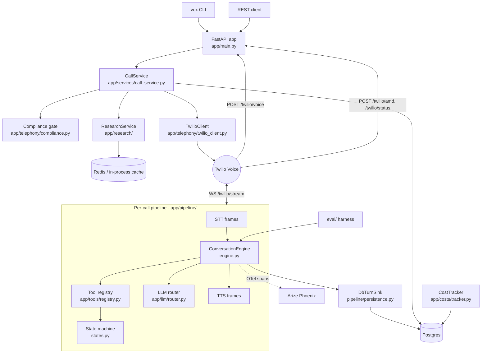
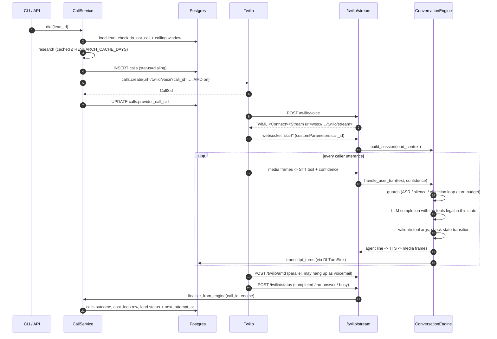
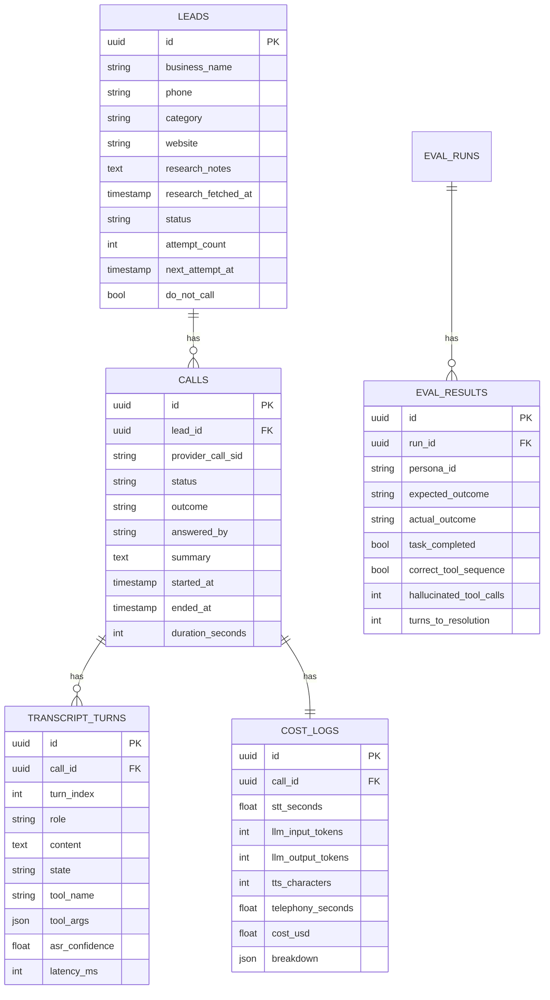

# Architecture

How the pieces fit together, and what happens on a single call from `POST /calls/dial`
to a finalised row in `cost_logs`.

## Component map

## Layering rules

The codebase is deliberately layered so the conversation logic can be tested without
Twilio, without a provider key and without Postgres.

| Layer | Modules | Knows about |
|---|---|---|
| Domain | `app/enums.py`, `app/pipeline/states.py`, `app/tools/` | nothing else |
| Conversation | `app/pipeline/engine.py`, `guards.py`, `prompts.py`, `flow.py` | domain + an LLM *protocol* |
| Providers | `app/llm/`, `app/stt/`, `app/tts/`, `app/telephony/`, `app/research/` | HTTP + config |
| Persistence | `app/db/` | SQLAlchemy models and repositories only |
| Services | `app/services/` | all of the above, orchestrates them |
| Edges | `app/api/`, `app/cli.py`, `eval/` | services |

`ConversationEngine` depends on the `LLMClient` protocol (`app/llm/base.py`), never on a
concrete provider. That single seam is what lets the eval harness drive the *real* flow
logic with a deterministic mock model, and lets the Pipecat runner drive it with Groq.

## Anatomy of one call

## The engine loop

`ConversationEngine.handle_user_turn()` is the heart of the system. Each turn:

1. **Guards run first.** Silence, low ASR confidence, objection cycles and the global
   turn budget can short-circuit the turn before any token is spent
   (`app/pipeline/guards.py`).
2. **Prompt assembly.** `prompts.py` builds a system prompt from the lead context,
   research notes, the current state and the state-specific instruction block.
3. **Tool exposure is state-scoped.** Only tools whose `allowed_states` contain the
   current state are sent to the model — a hallucinated `schedule_meeting` during
   Greeting is not just rejected, it was never offered.
4. **Validation.** Arguments are parsed by a Pydantic model
   (`app/tools/schemas.py`). A `ValidationError` is fed back to the model once
   (`MAX_TOOL_VALIDATION_RETRIES`), then the engine falls back to a scripted safe line.
5. **Transition.** The tool's `transition` function returns the target state; the engine
   refuses it unless `states.can_transition(current, target)` agrees.
6. **Persistence.** Every turn (role, text, state, tool name, tool args, latency,
   ASR confidence) is written through the turn sink.

The engine is pure `async` Python with no Pipecat import, so `tests/test_engine.py`
exercises the whole loop in milliseconds.

## Data model

`app/db/models.py` uses a portable `GUID` type (native `UUID` on Postgres, `CHAR(32)` on
SQLite) so the same schema and the same migrations run in CI and in production.

### Repository pattern

All SQL lives in `app/db/repositories.py`. Two rules, both learned the hard way:

* **No bulk `UPDATE` statements.** Under async SQLAlchemy 2.0 they leave the identity map
  stale, and `expire_all()` then explodes with `MissingGreenlet` on the next attribute
  access. Every setter loads the ORM object and mutates it (`_BaseRepository._apply`).
* **Setters do not guess.** `schedule_retry(lead_id, None)` only clears the timer; the
  caller decides whether the lead is `booked`, `rejected` or `exhausted`.

## Session state

Per-call conversation state lives in memory for the life of the websocket and is mirrored
into Redis (`app/cache/session.py`) when `REDIS_URL` is set, so a restart mid-campaign
doesn't lose the state of calls that are still connected. With no Redis configured the
module falls back to an in-process dict — correct for a single worker, which is exactly
how the container is meant to be scaled (one worker per instance, more instances).

## Observability

`app/observability.py` configures OpenTelemetry when `TRACING_ENABLED=true`, exporting to
an Arize Phoenix collector. Spans wrap each turn, each LLM call and each tool invocation.
Logging is `structlog`, human-readable in development and JSON in production
(`LOG_JSON=true`), with `call_id` bound to every line emitted during a call.
