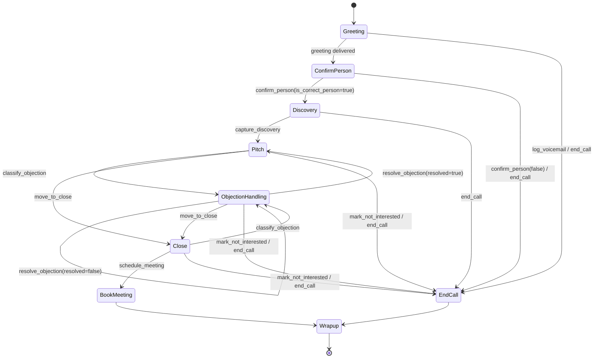

# Conversation state machine

Source of truth: `app/pipeline/states.py` (edges) and `app/tools/definitions.py`
(which tool is callable where, and where it goes). `vox flow show` prints both from a
live import, so this document can never quietly drift from the code — run it.

## States

`Wrapup` is not conversational: it is the post-call state in which the outcome is
finalised, the cost log is written and the lead's next attempt is scheduled.

## Every arrow is a tool call

The spec (Project-Details.md §5) names six tools. Six tools do not cover every arrow of
the diagram, which would leave transitions such as *Discovery → Pitch* to the model's
discretion — exactly the failure mode this project exists to avoid. Three transition
tools were therefore added (`capture_discovery`, `resolve_objection`, `move_to_close`)
so that **no state change can happen without a schema-validated tool call**.

| Tool | Callable in | Arguments (Pydantic) | Transition | Terminal outcome |
|---|---|---|---|---|
| `confirm_person` | ConfirmPerson | `is_correct_person`, `contact_name?`, `reason?` | → Discovery, or → EndCall | `wrong_person` / `unavailable` when false |
| `capture_discovery` | Discovery | `current_marketing`, `pain_point?`, `decision_authority?` | → Pitch | — |
| `classify_objection` | Pitch, ObjectionHandling, Close | `type`, `verbatim?` | → ObjectionHandling | — |
| `resolve_objection` | ObjectionHandling | `objection_type`, `resolved`, `rebuttal_summary?` | → Pitch if resolved, else stay | — |
| `move_to_close` | Pitch, ObjectionHandling | `interest_signal` | → Close | — |
| `schedule_meeting` | Close | `date` (ISO), `time` (24h IST), `contact_confirmation`, `duration_minutes`, `notes?` | → BookMeeting | `meeting_booked` |
| `mark_not_interested` | Pitch, ObjectionHandling, Close | `reason`, `objection_type?`, `can_follow_up_later` | → EndCall | `not_interested` |
| `end_call` | any active state | `outcome`, `reason` | → EndCall | as supplied |
| `log_voicemail` | any active state | `left_message`, `detail?` | → EndCall | `voicemail` |

Argument models are strict: `extra="forbid"`, no type coercion, bounded string lengths,
and semantic validators — `schedule_meeting` rejects a date that is not `YYYY-MM-DD`, a
time that is not `HH:MM`, or a slot in the past; `end_call` rejects a non-terminal
outcome. The objection `type` is a closed enum (`price`, `timing`, `not_interested`,
`need_to_think`, `no_budget`) — see `app/enums.py`. The model
cannot invent a category; an invalid value is a validation error, handled by the
malformed-tool-call path below.

## Two independent gates

A transition is only applied when **both** agree:

1. `TOOL_SPECS[name].allowed_states` contains the current state — enforced *before* the
   LLM call, by only exposing legal tools; and re-checked after, because a model can
   still emit a name it was not given.
2. `states.can_transition(current, target)` accepts the edge.

If either refuses, the engine does not move. It appends a short rejection note to the
model's context and retries once; the note is invisible to the caller and is explicitly
ignored by the "last user utterance" logic so it can never be mistaken for something the
lead said.

## Outcomes

| Outcome | Meaning | Resulting lead state |
|---|---|---|
| `meeting_booked` | `schedule_meeting` succeeded | `booked`, retry timer cleared |
| `not_interested` | hard no, or opt-out | `rejected`, retry timer cleared |
| `wrong_person` | not the decision maker | `contacted`, no further attempts |
| `callback_requested` | asked to be called back | `contacted`, no further attempts |
| `hung_up` | caller dropped mid-conversation | `contacted`, no further attempts |
| `unavailable` | right business, owner out | retried on the backoff schedule |
| `voicemail` | AMD or the model detected an answering machine | retried on the backoff schedule |
| `no_answer` | ring timeout, or silence with no speech | retried on the backoff schedule |
| `busy` | line busy | retried on the backoff schedule |
| `failed` | infrastructure error, or turn budget exhausted | retried on the backoff schedule |

Retryability is a property of the outcome (`CallOutcome.is_retryable`), not a branch
buried in the service. When the backoff schedule (`CALL_RETRY_BACKOFF_MINUTES`, default
`60,240,1440`) runs out or `CALL_MAX_ATTEMPTS` is reached, the lead becomes `exhausted`
and stops appearing in `campaign run`.

## Prompting

`app/pipeline/prompts.py` holds two prompt variants, selectable so the eval harness can
measure the difference between them:

* **`v2-strict-tools`** (default) — states the tool contract explicitly: never advance
  without calling a tool, never call a tool for a state you are not in, classify every
  objection before answering it, one question per turn, keep replies under ~35 words.
* **`v1-loose`** — a conventional "be a helpful sales agent" prompt with the same tools
  attached. It exists as a control: `make eval-regression` shows the harness catching the
  degradation (correct-tool-sequence 100% → 39.13%).

Both prompts are rendered with the lead's name, category, area and research notes so the
opening line is specific to the business ("I saw you're rated 4.6 on Google Maps in
Hauz Khas") rather than generic.
